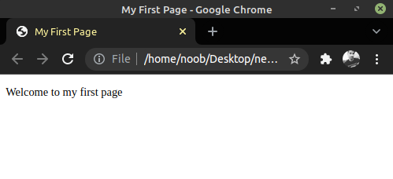
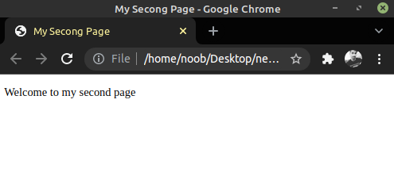

<h1 align="center">  </h1> 


* **HTML stands for Hyper Text Markup Language**

* **This is markup language use to make the skeleton of the website like butttons, pagaragraphs, content etc.**

* **Everything in HTML works in the form of tag.**
<hr>
<br>
<h2 align="center"> Let's get started </h2>

* Here's an example of basic HTML code.
```
<!DOCTYPE html>
<html>

<head>
    <title>My First Page</title>
</head>

<body>
    <p> Welcome to my first page </p>
</body>

</html>
```
* <p align="center"> Let's break this code into pieces. As I've mentioned earlier everything in HTML works in the form of tag.</p>

```
<!DOCTYPE html>
```
* This tag implies that this is an HTML document.

``` 
<html>  

</html>
 ```
* ```<html>``` this is how we open a tag & everthing we will do in html will be under this html tag. This is the starting of the html document & ``` </html> ``` this is the closing of the tag. **Every tag needs to be closed using ``` / ``` this backslash**
<br>
<br>
<br>
* **<p align="center"> NOTE - There are some exception in html tags which doesn't need any closing which we will take a look soon. <p>**

``` 
<head>

</head>
```
* This tag includes the meta data about the page which we are creating like title, JS(java script), encoding, Styling (CSS) etc. This is not visible to user.

    ```
    <title>My First Page</title>
    ```
    * As the name suggest, this is a sub-tag under ```<head>``` tag which have title of the page. **This is visible to user**

```
<body>

</body>
```
* This tag is the most important one because eveything we do in the tag will be directly visible to user on his browser. We'll spend our most the time under this tag.

```
<p> Welcome to my first page </p>
```
* This is called p-tag it's for the paragraph in the HTML page.

    * Let's take a look into the output of the code we've writted & understood so far.

<br>

**NOTE - TO run this code in your local machine/PC/Laptop create a new text document & copy-paste the code or write it down save that text document with any name but with an extension of <i>.html</i> extension.**

<hr>
<br>

 <br>
* As you can see title is <b>My first page</b> & <i>Welcome to my first page</i> is visible which is under p-tag.

* Now we've seen some basic of html & to support this claim we first need to see the power of the html tags. I've added some tags so take a look & start experimenting on your own. I'll show you some examples as well.

<hr>
<br>

* Before moving forward let's learn one more easy and small concept that is <b>COMMENTS</b> in HTML.
```
<!DOCTYPE html>
<html>

<head>
    <title>My Secong Page</title>
</head>

<body>
    <p> Welcome to my second page </p>
    <!-- this is an example of comments in html & we no one will be able to see it except who have access to the source code of the document. -->
</body>

</html>
```


* As in the above screenshot you can see a special tag ```<!-- -->``` whatever you write between this tag won't be visible to user. This is how comments work in html.